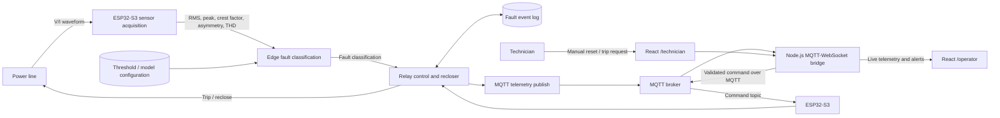

# SafeNetQ
## Real-Time Monitoring and Relay-Based Protection for Power Distribution Systems: A Self-Powered IoT Approach with High Impedance Fault Detection.

[](#phase-1-mvp-scope)
[](#hardware-bill-of-materials)
[](#software-stack)
[](#software-stack)
[](#system-architecture-and-flow)
[](./LICENSE)

## Abstract

This project investigates real-time monitoring and relay-based protection for a single-phase power-distribution prototype. The intended system combines local sensing and protection at an ESP32-S3 edge node with MQTT telemetry, a Node.js MQTT-to-WebSocket bridge, and a React SCADA-style dashboard. It is designed to distinguish overcurrent, short-circuit, and high-impedance-fault (HIF) conditions and to operate a physical relay independently of network availability.

The final system described by the broader SRS includes an energy-harvesting, self-powering module. **That module is not part of v0.1.** This MVP is limited to proving the core IoT protection logic, real-time SCADA telemetry, and edge-based HIF detection in a controlled prototype. GSM/SIM800L backup alerting shown in the supplied diagrams is also **excluded from v0.1**.

> **Prototype limitation:** SafeNetQ v0.1 is an academic prototype, not a certified protective device. Do not connect it to a live distribution installation. Protection thresholds, electrical isolation, relay ratings, fail-safe behavior, and fault simulations must be reviewed and tested using an appropriately supervised, isolated laboratory setup.

## Project Team

| Team member | Project role |
| --- | --- |
| Hrushikesh | Software, ML & Cloud Architecture Lead |
| [Insert Partner's Name] | Hardware & Power Systems Lead |

## Phase 1 MVP Scope

### Included in v0.1

- Local ESP32-S3 monitoring and classification of **overcurrent**, **short circuit**, and **HIF** conditions.
- Current waveform acquisition from a ZMCT103C at a target sampling rate of **4 kHz**, with features including peak current, crest factor, and rate of change (`di/dt`) supplied to the edge classifier.
- PZEM-004T energy readings at a slower **1 Hz** rate.
- Local relay trip behavior and fault-type-specific recloser/lockout handling.
- MQTT telemetry from the edge node through a Node.js bridge to a WebSocket-connected React dashboard.
- Distinct operator and technician dashboard views at `/operator` and `/technician`.
- A physical dimmer switch used in an isolated, supervised test setup to produce distorted waveforms for HIF-detection experiments. A dimmer is a test stimulus and does not reproduce every real-world HIF.
- Manual reset and manual trip requests from the technician interface, subject to firmware-side validation and safety interlocks.

### Explicitly excluded from v0.1

- Self-powering or energy-harvesting circuitry.
- GSM/SIM800L backup alerts and cellular connectivity.
- Three-phase or multi-device monitoring, fault-distance estimation, and geographic views.
- Persistent cloud storage or database-backed event history.

The relay protection action is intended to happen **locally before any cloud publication**. Network or broker failure must not prevent local fault detection and tripping. Dashboard commands are supervisory requests; they do not replace local firmware protection.

## Hardware Bill of Materials

| Component | Role in the current prototype |
| --- | --- |
| **ESP32-S3 dual-core edge microcontroller** | Acquires sensor data, executes local protection and fault-classification logic, drives the relay output, and publishes telemetry over Wi-Fi/MQTT. |
| **ZMCT103C current transformer (CT) sensor** | Provides the current waveform input. The target raw analog sampling rate is **4 kHz** to derive waveform features such as crest factor and `di/dt` for edge classification. |
| **PZEM-004T energy meter** | Provides slower electrical and energy measurements, polled at approximately **1 Hz**. Intended readings include voltage, real power, accumulated energy, frequency, and power factor. |
| **5 V isolated AC-DC power supply** | Supplies the prototype electronics with isolated low-voltage power. This is not an energy-harvesting supply. |
| **Mechanical relay module** | Acts as the physical trip/reclose actuator under local ESP32-S3 control. Select and operate it only within its verified electrical ratings. |
| **Physical dimmer switch (test equipment)** | Introduces controlled waveform distortion for HIF-detection experiments in an appropriately isolated and supervised test circuit; it is not a protection-system component. |

## System Architecture and Flow

The diagrams supplied with the project describe a local protection path and a separate telemetry/command path. The v0.1 interpretation below retains the diagrams' protection and user flows while omitting their GSM backup path.

### Level-0 context

The power line supplies voltage/current measurements to the **SafeNetQ Fault Protection System**. The system sends live telemetry and alerts to the **Facility Operator** dashboard. The **Maintenance Technician** can request a manual reset or trip. A trip/reclose action is sent back to the power line through the relay. The diagram also shows GSM backup alerts, but cellular alerting is out of scope for this MVP.

### Level-1 data flow

1. **Sensor acquisition:** The edge node samples the CT waveform and reads the PZEM-004T measurements.
2. **Fault classification:** The ESP32-S3 derives RMS and peak current, crest factor, asymmetry, and total harmonic distortion (THD), then evaluates these against the configured threshold/model store. The intended output states are `NORMAL`, `OVERCURRENT`, `SHORT_CIRCUIT`, and `HIF`.
3. **Relay control and event logging:** The edge node applies the fault-specific trip/reclose/lockout policy, drives the relay, and records the local fault event and strike state.
4. **Telemetry and alert publication:** After the local protection action, the edge node publishes fault state and measurements over MQTT. The bridge forwards updates to the dashboard over WebSocket. The browser event log is temporary/in-memory for this MVP; no persistent database is required.



### Sequence and protection policy

The sequence diagram places fault handling on the ESP32-S3 before MQTT or dashboard notification:

1. The ESP32-S3 receives sampled line measurements and computes waveform features, then classifies the state.
2. For a detected fault, it commands the relay to open the circuit locally. This action does not depend on Wi-Fi, MQTT, or the dashboard.
3. For **overcurrent** and **short circuit**, the design allows a reclose attempt after a **3-second dead time**, up to **three attempts**. Current is sampled after each reclose. A return to normal resets the strike counter; a persistent fault increments it, and three failed attempts result in lockout.
4. For **HIF**, the design specifies **immediate lockout without an automatic reclose attempt**, because reclosing into a potentially live arc is unsafe.
5. After the local action, the device publishes telemetry/fault information over MQTT. The bridge distributes it to the dashboard using WebSocket. GSM/SMS, shown as a backup in the diagrams, is not implemented in v0.1.
6. A technician may issue a manual reset or trip through the dashboard-to-bridge-to-MQTT command path. A successful MQTT publish only confirms broker acceptance; the interface must rely on subsequent device telemetry to confirm the hardware state.

Reclose timing, attempt counts, lockout reset conditions, and all electrical thresholds must be confirmed against the firmware implementation and test plan before hardware operation.

### User roles and dashboard routes

| Route / actor | Intended use |
| --- | --- |
| **Facility Operator — `/operator`** | Read-only live SCADA view with a live RMS-current graph, PZEM energy readings, ZMCT103C features, protection state, and active fault alerts. Metric sparklines retain up to the latest 10 received readings. |
| **Maintenance Technician — `/technician`** | Technician-oriented event history with timestamps, fault types, and actions, plus manual reset/manual trip controls. Commands are requests to the edge node, not confirmation that the relay operated. |
| **ESP32-S3 edge node** | Automated actor that monitors voltage/current, classifies faults, controls the relay/recloser, logs events, and publishes telemetry. |

The dashboard is a monitoring and supervisory interface. Safety-critical protection decisions and relay operation belong on the edge node.

## Software Stack

| Layer | Technology | Responsibility |
| --- | --- | --- |
| Edge firmware | C++ with FreeRTOS on ESP32-S3 | Time-sensitive sampling, feature extraction, local fault classification, relay/recloser control, event-state tracking, and MQTT telemetry. |
| Messaging | MQTT | Carries device telemetry and technician commands through the configured broker. |
| Backend bridge | Node.js | Subscribes to MQTT telemetry, forwards it to browser clients over WebSocket, and validates/forwards dashboard commands to MQTT. |
| Frontend | React | Presents the operator `/operator` SCADA route and technician `/technician` route. |

### ESP32-S3 task/core allocation

The intended dual-core partition is:

- **Core 0 — communications:** Wi-Fi connectivity, MQTT publish/subscribe work, and non-critical telemetry handling.
- **Core 1 — protection:** hard real-time waveform sampling/processing, fault-classification work, and relay-control decisions.

This is an architectural allocation target, not a substitute for timing validation. The firmware must keep communication tasks from blocking protection work and must demonstrate sampling and relay-response timing under load.

## Telemetry and Command Contract

The device-to-dashboard telemetry is expected to include a timestamp, protection state, and measurements where available. Measurements are grouped under `telemetry`:

| Field | Meaning |
| --- | --- |
| `timestamp` | ISO-8601 sample/event time. |
| `telemetry.current_rms` | RMS line current in amperes; publish frequently enough for live dashboard updates (target: at least every 500 ms). |
| `telemetry.voltage`, `telemetry.real_power`, `telemetry.energy`, `telemetry.frequency`, `telemetry.power_factor` | PZEM-004T measurements; slow energy-meter updates are approximately 1 Hz. Power factor is in the range 0–1. |
| `telemetry.peak_current`, `telemetry.crest_factor`, `telemetry.di_dt` | CT-derived features; `di_dt` is expressed in A/ms. |
| `inference.fault_status` | One of `NORMAL`, `OVERCURRENT`, `SHORT_CIRCUIT`, or `HIF`. |
| `inference.strike_count` | Current recloser strike count where applicable. |
| `device_state` | Device/relay protection state as reported by firmware. |

Unavailable optional readings should be displayed as unavailable, not inferred from unrelated values. The schema above describes the intended MVP contract; the repository does not yet include a machine-readable contract file.

The technician UI sends command frames to the bridge in this form:

```json
{ "type": "command", "id": "web-...", "command": "RESET" }
```

The bridge validates the request and publishes the corresponding MQTT payload to the configured command topic:

```json
{ "command": "RESET" }
```

Manual trip uses `"command": "TRIP"`. A bridge acknowledgement indicates that the broker accepted the publish; it does **not** prove that the ESP32-S3 received or executed the command. Confirm execution through device telemetry and the physical relay state.

## Setup and Installation

> **Repository status:** The `bridge/`, `dashboard/`, and `firmware/` directories are currently architectural placeholders and do not yet contain package manifests, server entry points, or firmware build configuration. The commands below are setup templates; update paths and start scripts when those implementation files are added.

### 1. Clone the repository

```bash
git clone https://github.com/techie-hrushik027/SafeNetQ.git
cd SafeNetQ
```

### 2. Install bridge dependencies and configure MQTT

After adding a `package.json` to `bridge/`, install its dependencies:

```bash
cd bridge
npm install
```

Configure the bridge with the address of an MQTT broker reachable from the development machine and the device. Keep broker credentials out of version control. Example variable names (align these with the eventual bridge implementation):

```env
MQTT_BROKER_URL=mqtt://<broker-host>:1883
MQTT_TOPIC=safenetq/telemetry
MQTT_COMMAND_TOPIC=safenetq/commands
MQTT_USERNAME=
MQTT_PASSWORD=
WS_PORT=8080
```

### 3. Install dashboard dependencies

After adding the React application and its `package.json` to `dashboard/`:

```bash
cd ../dashboard
npm install
```

### 4. Run the backend bridge and frontend

Once the corresponding start scripts and entry points are implemented, run each service in a separate terminal. Replace the placeholder command with the project's actual script if it differs:

```bash
# Terminal 1: MQTT-WebSocket bridge
cd bridge
npm start
```

```bash
# Terminal 2: React dashboard
cd dashboard
npm start
```

Configure the dashboard's WebSocket URL to point to the bridge (for example, `ws://localhost:8080` in local development). Use a TLS WebSocket endpoint (`wss://`) when the deployed service requires it.

### 5. Build and flash the ESP32-S3 firmware

The firmware build/flash command depends on the build system selected for `firmware/` and is not yet defined in this repository. Add the platform configuration, board pin map, sensor calibration, MQTT settings, and verified protection parameters before building. Do not use example thresholds as operational protection settings.

## Repository Layout

```text
SafeNetQ/
├── bridge/       # Planned Node.js MQTT-WebSocket bridge
├── dashboard/    # Planned React operator and technician SCADA UI
├── firmware/     # Planned ESP32-S3 / FreeRTOS C++ firmware
├── LICENSE
└── README.md
```

## Validation and Safety

Before treating the MVP as operational, validate at minimum:

- CT calibration, analog input range, sampling rate, and derived-feature calculations.
- PZEM-004T readings and their 1 Hz update behavior.
- Protection-task scheduling and relay response under Wi-Fi/MQTT load.
- Fault-state classification, especially HIF detection with controlled dimmer-generated distortion.
- Three-attempt, 3-second reclose behavior for overcurrent/short circuit and immediate HIF lockout.
- MQTT telemetry/command schemas, broker-loss behavior, and confirmation of command execution from device state.
- Electrical isolation, relay ratings, reset interlocks, and fail-safe behavior under the laboratory test plan.

Use an isolated, current-limited test rig and qualified supervision. Do not test by inducing faults on an energized public or building distribution circuit.

## License

This project is licensed under the MIT License. See [`LICENSE`](./LICENSE).
